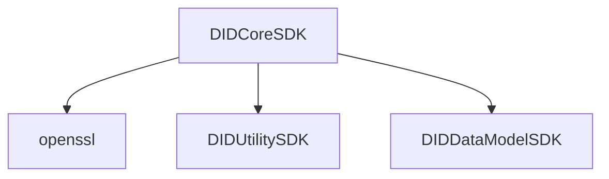

KeyManager(키 생성, 삭제, 상태 조회), SecureEncryptor, DIDManager(DID Document Wallet을 관리), VCManager(VC Wallet을 관리)
(https://github.com/OmniOneID/did-client-sdk-ios/blob/develop/docs/api/did-core-sdk-ios/SecureEncryptor_ko.md)

### KeyManager
- 키 생성(Wallet, SecureEnclave), 삭제, 상태조회.
- changePin(walletPin 변경).
- sign(hashed값 서명), verify(서명값 검증)
### SecureEncryptor
- SecureEnclave로 평문을 암복호화
### DIDManager
- genDID: DID 문자열을 반환(`did:omn:3kH8HncYkmRTkLxxipTP9PB3jSXB`)
- init: DID Document Wallet을 관리하는 DIDManager 인스턴스를 생성
	- fileName: DID 문서를 저장할 월렛 파일 이름
- isSaved: 월렛에 저장된 DID 문서의 존재 여부를 반환
- createDocument: 파라미터를 사용해 `임시 DIDDocument 객체`를 생성하여 내부 변수로 관리. 이 단계에서는 월렛에 저장하지 않음.  isSaved API의 리턴값이 false인 경우에만 호출 가능.
- getDocument: `임시 DIDDocument 객체`를 리턴. `임시 DIDDocument 객체`가 nil이면, 저장된 DID 문서를 리턴.
- replaceDocument: `임시 DIDDocument 객체`를 입력받은 객체로 대치.
- saveDocument: `임시 DIDDocument 객체`를 월렛 파일에 저장한 후에 초기화. 이미 저장된 파일을 대상으로 변경사항이 없는 상태, 즉, `임시 DIDDocument 객체`가 nil인 상태에서 호출한다면 아무런 동작을 하지 않음.
- deleteDocument: 저장된 월렛 파일을 삭제. 파일 삭제후, `임시 DIDDocument 객체`를 nil로 초기화.
- addVerificationMethod: `임시 DIDDocument 객체`에 공개키 정보를 추가. 주로 저장된 DID 문서에 새로운 공개키 정보를 추가하는 경우에 사용.
- removeVerificationMethod: `임시 DIDDocument 객체`에 공개키 정보를 삭제한다. 주로 저장된 DID 문서에 등록된 공개키 정보를 삭제하는 경우에 사용.
- addService: `임시 DIDDocument 객체`에 서비스 정보를 추가. 주로 저장된 DID 문서에 등록된 서비스 정보(LinkedDomains, CredentialRegistry)를 추가하는 경우에 사용.
- removeService: `임시 DIDDocument 객체`에서 서비스 정보를 삭제. 주로 저장된 DID 문서에 등록된 서비스 정보를 삭제하는 경우에 사용.
- resetChanges: 변경사항을 초기화하기 위해 `임시 DIDDocument 객체`를 nil로 초기화. 저장된 DID 문서 파일이 있는 경우에만 사용 가능(저장된 DID 문서 파일이 없는 경우에는 에러가 발생).
### VCManager
- VC Wallet을 관리
- isAnyCredentialsSaved: 저장된 VC가 1개 이상 있는지 확인(VC 월렛이 존재하는지 확인)
- addCredential: VC를 월렛에 저장
- getCredentials: 월렛에서 identifiers와 일치하는 VC를 모두 반환
- getAllCredentials: 월렛에 저장된 VC를 모두 반환
- deleteCredentials: 월렛에서 identifiers와 일치하는 VC를 모두 삭제
- deleteAllCredentials: VC가 저장된 월렛을 삭제
- makePresentation: Proof❓가 없는 VP(VerifiablePresentation) 객체를 반환
	- Proof: Owner proof.
		- created
		- proofPurpose(ProofPurpose) : assertionMethod, authentication, keyAgreement, capabilityInvocation, capabilityDelegation
		- verificationMethod
		- type(ProofType): Signature2018, secp256k1Signature2018, secp256r1Signature2018
		- proofValue
	- VCProof: Issuer proof
		- created
		- proofPurpose(ProofPurpose) : assertionMethod, authentication, keyAgreement, capabilityInvocation, capabilityDelegation
		- verificationMethod
		- proofValue
		- proofValueList

---

### StorageManager
- key, did, vc
- saveItems
	- digest: VerifiableCredential data를 jsonEncode -> base64String -> 다시 jsonEncode -> sha256
	- SE Manager로 서명 -> base64String -> jsonEncode
	- 파일로 저장
### Secp256R1Manager

### SecureEnclaveManager
