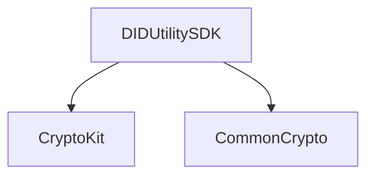

암호화를 위한 유틸리티
(https://github.com/OmniOneID/did-client-sdk-ios/blob/develop/docs/api/did-utility-sdk-ios/Utility_ko.md)

### CryptoUtils
- generateNonce, generateECKeyPair, generateSharedSecret, pbkdf2, encrypt/decrypt, aesCrypt, isValid
### MultibaseUtils
- encode(base16, base16Upper, ,base58BTC, base64, base64URL)
- decode
### DigestUtils
- getDigest(sha256, sha384, sha512)
