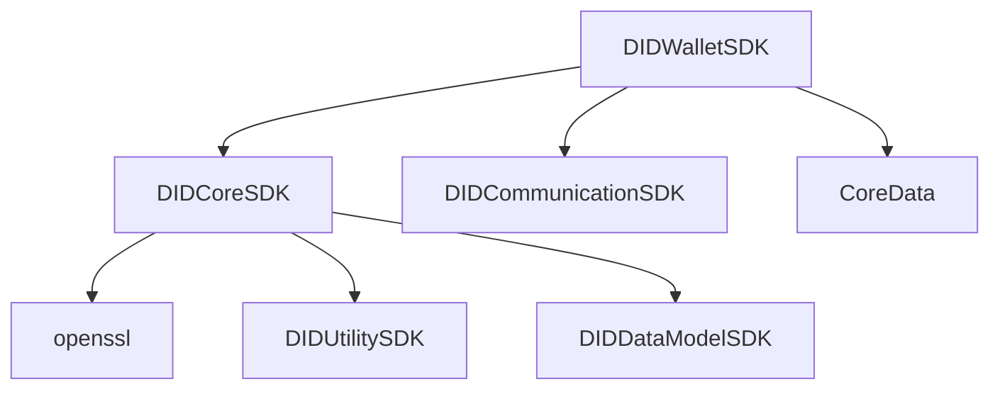

(https://github.com/OmniOneID/did-client-sdk-ios/blob/develop/docs/api/did-wallet-sdk-ios/Wallet_ko.md)

### CoreData
- CaEntity: idx, createDate, pkgName
- TokenEntity: idx, walletId, hWalletToken, validUntil, nonce, pkgName, pii, createDate
- UserEntity: idx, pii, finalEncKey, createDate, updateDate

### WalletAPI(Singleton)
- isExistWallet
- createWallet
- deleteWallet
- createWalletTokenSeed
- createNonceForWalletToken
- bindUser: Wallet에 사용자 개인화를 수행
- unbindUser: 사용자 비개인화❓를 수행
- registerLock: Wallet의 잠금 상태를 설정
- authenticateLock: Wallet의 Unlock을 위한 인증을 수행
- createHolderDIDDocument: 사용자 DID Document를 생성
- createSignedDIDDoc: 서명된 사용자 DID Document 객체를 생성
- getDIDDocument: DID Document를 조회
- generateKeyPair: 서명을 위한 PIN 키 쌍을 생성하여 Wallet에 저장
- isLock: Wallet의 잠금 타입을 조회
- getSignedWalletInfo: 서명된 Wallet 정보를 조회
- requestRegisterUser
- getSignedDIDAuth: DIDAuth 서명을 수행
- requestIssueVc: VC 발급을 요청
- requestRevokeVc: VC 폐기를 요청
- getAllCredentials: Wallet에 저장된 모든 VC를 조회
- getCredential: 특정 VC를 조회
- deleteCredentials: 특정 VC를 삭제
- createEncVp: 암호화된 VP와 accE2e를 생성
- getKeyInfos
	- Wallet에 저장된 특정 VerifyAuthType(free❓, pin, bio, and❓)에 대한 키정보를 불러옴
	- Wallet에 저장된 특정 id에 대한 키정보를 불러옴

### WalletLockManager
- `isLock == true`면
	- `passcode`를 CEK(Contents Encrypting Key)로 암호화 후(=`finalEncCek`) KeyChain에 저장하고,
	- `finalEncCek`를 `base58BTC` 로 encode해서 UserEntity에 저장
- `isLock == false`면 CoreData의 UserEntity에 저장

### WalletService

### WalletToken

### WalletCore

---

### KeyChainWrapper
- WalletLockManager에서 사용

---

tasUrl: Trusted Application Service의 URL
walletURL: Wallet이 등록될 URL